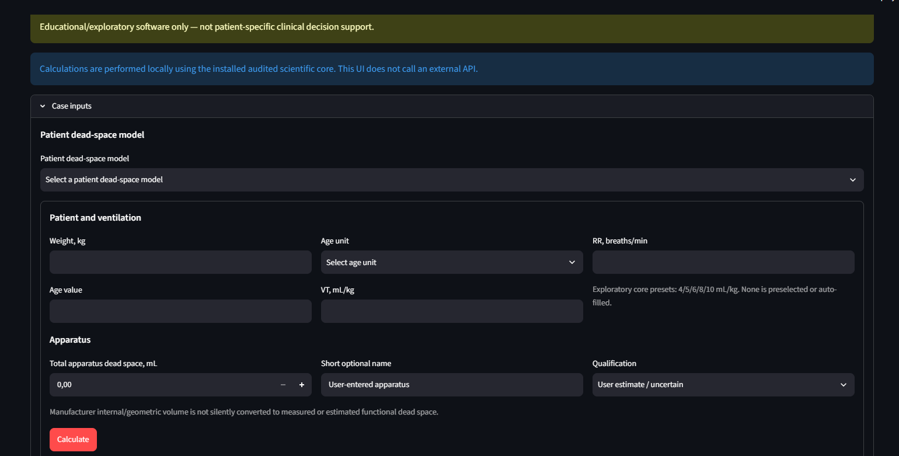
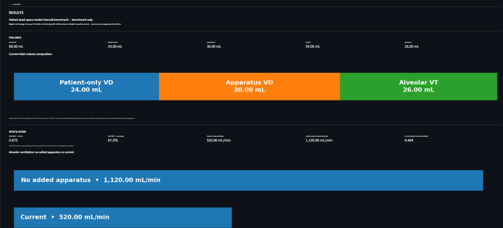
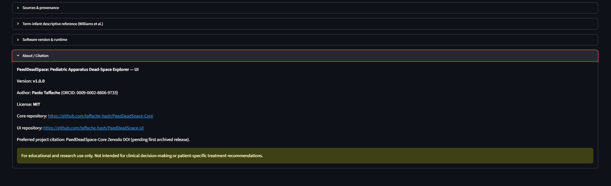

# PaedDeadSpace-UI

[](https://github.com/taffache-hash/PaedDeadSpace-UI/releases/tag/v1.0.0)
[](LICENSE)
[](https://github.com/taffache-hash/PaedDeadSpace-UI/actions/workflows/tests.yml)


**PaedDeadSpace: Pediatric Apparatus Dead-Space Explorer — UI** is the Streamlit presentation layer for PaedDeadSpace. It depends on the tagged **PaedDeadSpace-Core v1.0.0** release and does not duplicate the scientific equations.

> For educational and research use only. Not intended for clinical decision-making or patient-specific treatment recommendations.

## Screenshots
Screenshots captured from the final v1.0.0 UI running locally with PaedDeadSpace-Core v1.0.0.

### Case inputs


### Pearsall golden benchmark


### About / Citation


## Run from source
Python **3.11–3.13** is supported.

```bash
python -m pip install -r requirements-ui.txt
python -m pip install -r requirements-test.txt
python -m pytest -q
python -m streamlit run app.py
```

## Scientific scope
The UI collects model inputs, calls the Core, displays volumes/ventilation/apparatus-effect outputs, warnings, provenance, and descriptive reference information. All scientific calculations remain in PaedDeadSpace-Core.

## Model assumptions
The displayed outputs inherit the Core assumptions: one-compartment framework, patient/apparatus dead-space separation, and fixed-VCOâ‚‚ interpretation for relative COâ‚‚ burden and compensatory RR.

## Known limitations
The interface is not a clinical calculator, does not validate patient-specific treatment targets, and does not convert group-reference values into universal defaults. Model-boundary states are displayed explicitly rather than extrapolated into extreme RR values.

## Golden Pearsall benchmark
10 kg, age 2 years, VT 8 mL/kg, RR 20/min, Pearsall benchmark, apparatus DS 30 mL should reproduce: total VD 54 mL, VD/VT 67.5%, alveolar VT 26 mL, alveolar ventilation 520 mL/min, relative COâ‚‚ burden/RR multiplier 2.154, and RR required 43.08/min.

This is a reproducibility benchmark, not a physiological default.

## Privacy / runtime
Calculations are local. This UI does not call an external API. Streamlit usage-statistics collection is disabled by the included configuration.

## Citation
The Core DOI is the preferred citation for the scientific project once Zenodo assigns it. Use this component DOI when specifically citing the UI implementation.

## Author
**Paolo Taffache** — ORCID: 0009-0002-8806-9733  
General and Pediatric Anesthesia and Intensive Care Unit, IRCCS AOU Bologna – Policlinico Sant’Orsola-Malpighi, Bologna, Italy  
Contact: taffache@gmail.com

## Funding and AI disclosure
Funding: **None**.

AI-assisted tools were used during software development, code review, documentation, and packaging. Scientific assumptions, source selection, validation decisions, and final responsibility remained with the author.

## License
MIT License. Copyright (c) 2026 Paolo Taffache.

